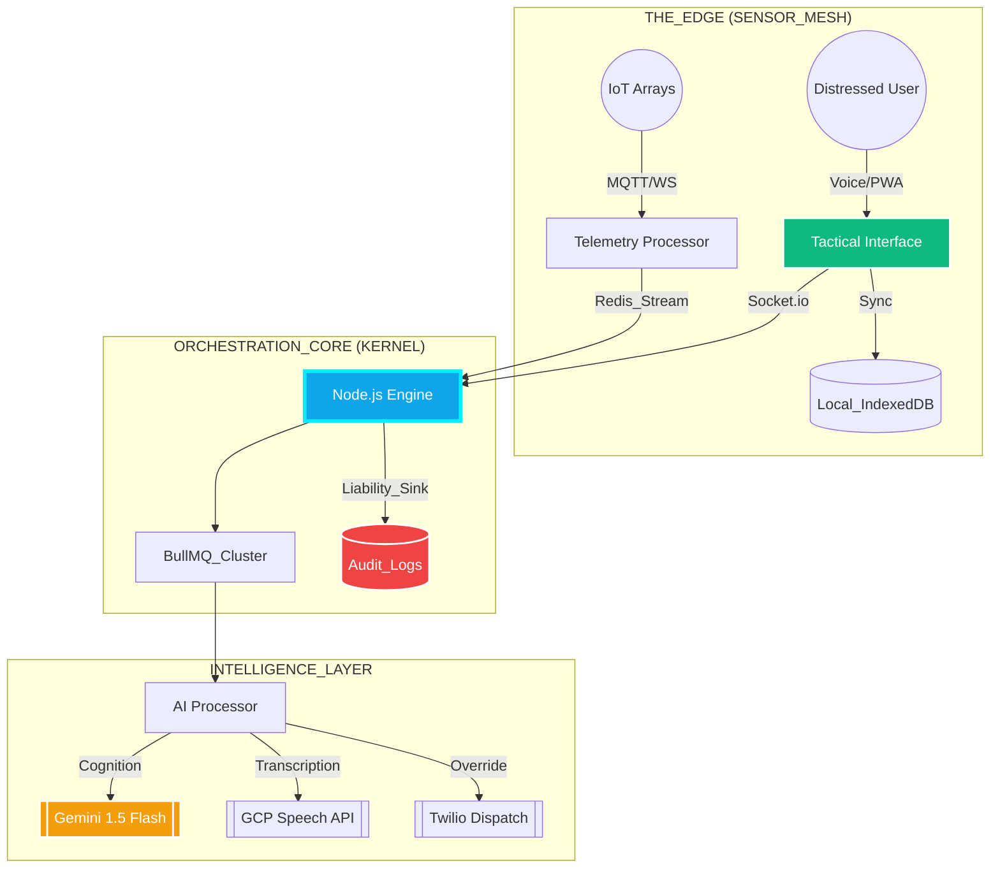

<div align="center">

# 🦚 RAPID CRISIS RESPONSE (RCR)
### *Next-Gen AI Emergency Orchestration for Hospitality & Urban Infrastructure*                    

<p align="center">
  
</p>

[](https://github.com/Praveen-kumar625/Rapid-Crisis-Response)
[](https://github.com/Praveen-kumar625/Rapid-Crisis-Response)
[](https://github.com/Praveen-kumar625/Rapid-Crisis-Response)

---

[**📡 LIVE_TACTICAL_LINK**](https://rapid-crisis-response-f4yd.vercel.app/) • [**📂 SOURCE_INTEL**](https://github.com/Praveen-kumar625/Rapid-Crisis-Response) • [**🌍 GLOBAL_IMPACT**](./SDG_ALIGNMENT.md) • [**📜 AUDIT_LOGS**](#-deployment--setup)

</div>

## 🌌 THE MISSION DIRECTIVE
In the high-stakes theater of hospitality and urban infrastructure, **seconds determine survival**. Legacy systems are siloed and fragile. **RCR** is an AI-native, offline-resilient nerve center that automates triage, visualizes invisible hazards, and orchestrates surgical response efforts across a decentralized ecosystem.

---

## ⚡ CORE_PIPELINES

<div align="center">

| 🤖 HYBRID_INTELLIGENCE | 📡 IOT_TELEMETRY_GRID |
| :--- | :--- |
| **Gemini 1.5 Flash** + **Edge AI**. Instant crisis classification at the hardware level. Reliable even during a total network blackout. | High-frequency sensor fusion (Smoke, Thermal, CO2) providing a real-time "Biometric Pulse" of building health. |

| 🎙️ MULTILINGUAL_VOICE_SOS | 🗺️ Z-AXIS_DYNAMIC_ROUTING |
| :--- | :--- |
| **GCP STT + Translate** integration. Speak your emergency in any tongue; the system triages and dispatches in milliseconds. | Intelligent indoor pathfinding that avoids heat-zones and smoke-filled hallways. Real-time rerouting as hazards evolve. |

</div>

---

## 📋 TACTICAL_ORCHESTRATION (PHASE_4_ENABLED)

RCR has been upgraded to **V3.0 ULTRA** status, moving beyond reporting into active field command:

- **[ 🎯 SMART_DISPATCH ]**: AI-generated action plans are automatically decomposed into granular tasks and assigned to the best-suited responder based on role and Z-axis proximity.
- **[ 💀 DEAD_MANS_SWITCH ]**: A dual-channel fallback protocol. If a responder doesn't acknowledge a directive via WebSocket within 5s, an **Emergency SMS Override** is dispatched via Twilio.
- **[ 🛡️ RESILIENCE_LAYERS ]**: Full audit-integrity logging for every status change, ensuring liability-grade accountability for post-crisis analysis.

---

## 🏗️ SYSTEM_NEURAL_MAP



---

## 🛠️ TECHNOLOGICAL_FUSION

| STACK_LAYER | COMPONENT_INTEL |
| :--- | :--- |
| **COMMAND_CENTER** |    |
| **NEURAL_BACKBONE** |    |
| **DATA_PERSISTENCE** |    |

---

## 🚀 DEPLOYMENT_PROTOCOLS

### 1. INITIALIZE_DOCKER_GRID
```bash
# Clone and enter directory
git clone https://github.com/Praveen-kumar625/Rapid-Crisis-Response.git
cd Rapid-Crisis-Response/RCR

# Boot entire ecosystem (Backend + Worker + Frontend + DB)
docker-compose up --build -d
```

### 2. KERNEL_CONFIGURATION
Configure `.env` with critical intelligence tokens:
```env
GOOGLE_AI_KEY=your_gemini_key
GOOGLE_APPLICATION_CREDENTIALS=path_to_gcp_json
TWILIO_AUTH_TOKEN=your_twilio_key
```

---

<div align="center">

### [ IMPACT_REPORT ]
**- 90% REDUCTION** in triage latency via automated AI cognition.
**- 100% ACCOUNTABILITY** through responder presence tracking.
**- ZERO_SIGNAL_RESILIENCE** using edge-caching and PWA protocols.

<p align="center">
  
</p>

**ENGINEERED FOR THE GOOGLE SOLUTION CHALLENGE 2026**

[](https://github.com/Praveen-kumar625)

### JAY SHREE SHYAM 🦚

</div>
