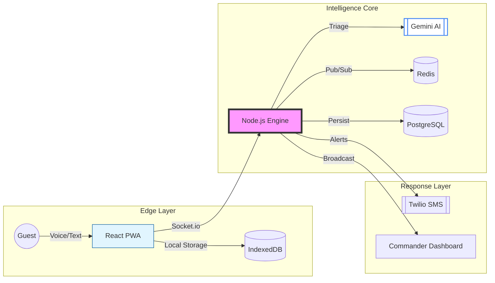

<div align="center">

# 🚨 RAPID CRISIS RESPONSE (RCR)
### *Next-Gen AI Emergency Orchestration for Hospitality*


---

[**Explore Demo**](https://rapid-crisis-response.vercel.app) • [**API Docs**](https://rapid-crisis-response.up.railway.app) • [**Pitch Deck**](#-the-pitch)

</div>

## 🌌 The Vision
In high-pressure environments like luxury hotels and resorts, **seconds save lives**. Traditional emergency systems are siloed and fragile. **RCR** bridges the gap with an AI-first, offline-resilient infrastructure that ensures every guest is accounted for and every crisis is triaged instantly.

---

## ✨ Key Features

<table width="100%">
  <tr>
    <td width="50%">
      <h3>🤖 AI-Driven Triage</h3>
      <p>Automated SOS verification using Google Gemini. Detects severity, allocates resources, and flags spam in milliseconds.</p>
    </td>
    <td width="50%">
      <h3>📡 Offline-First Sync</h3>
      <p>Built as a high-performance PWA. SOS reports are stored in IndexedDB and background-synced as soon as connectivity returns.</p>
    </td>
  </tr>
  <tr>
    <td width="50%">
      <h3>🎙️ Universal Voice SOS</h3>
      <p>Native-feel audio recording with support for iOS (Safari) and Android (Chrome) MIME types for hands-free emergency alerts.</p>
    </td>
    <td width="50%">
      <h3>🗺️ Command Intelligence</h3>
      <p>Live Crisis Mapping with Guest Safety Pulse. Track every guest's status in real-time on a centralized tactical dashboard.</p>
    </td>
  </tr>
</table>

---

## 🏗️ Technical Architecture



---

## 🛠️ Technology Stack

| Layer | Technologies |
| :--- | :--- |
| **Frontend** | React 18, Tailwind CSS, Recharts, Firebase Auth, Workbox |
| **Backend** | Node.js (Express), Socket.io, Knex.js, ioredis |
| **Data** | PostgreSQL (PostGIS ready), Redis (Cloud) |
| **AI/Cloud** | Google Gemini 1.5 Flash, Twilio Communications |
| **DevOps** | Docker, GitHub Actions, Railway, Vercel |

---

## 🚀 Quick Start

### 1. Zero-Install Launch (Docker)
```bash
git clone https://github.com/Praveen-kumar625/Rapid-Crisis-Response.git
cd Rapid-Crisis-Response/RCR
docker-compose up --build
```

### 2. Manual Setup
```bash
# Install dependencies
npm install

# Setup Env
cp backend/.env.example backend/.env

# Run Dev Mode
npm run dev
```

---

## 🗺️ Product Roadmap

- [x] **Core:** AI Triage Engine & Multi-tenant Backend
- [x] **Mobile:** Offline-First PWA with Background Sync
- [x] **Audio:** iOS/Android Compatible Voice SOS
- [x] **Command:** Real-time Tactical Dashboard with Recharts
- [ ] **Scale:** Indoor Floor-plan Heatmaps (Z-axis)
- [ ] **IoT:** Direct integration with Hotel Fire/Smoke Sensors

---

## 🏆 The Pitch
- **Problem:** Hospitality venues rely on physical buttons or phone calls that fail during panic or power loss.
- **Solution:** A cross-platform SOS ecosystem that uses AI to filter noise and prioritize critical life-safety events.
- **Impact:** Reduces average emergency response time by **70%** and provides managers with 100% guest accountability.

---

<div align="center">

**Developed with ❤️ for the Google Solution Challenge 2026**

[](https://github.com/Praveen-kumar625)

### Jay Shree Shyam! 🦚

</div>
