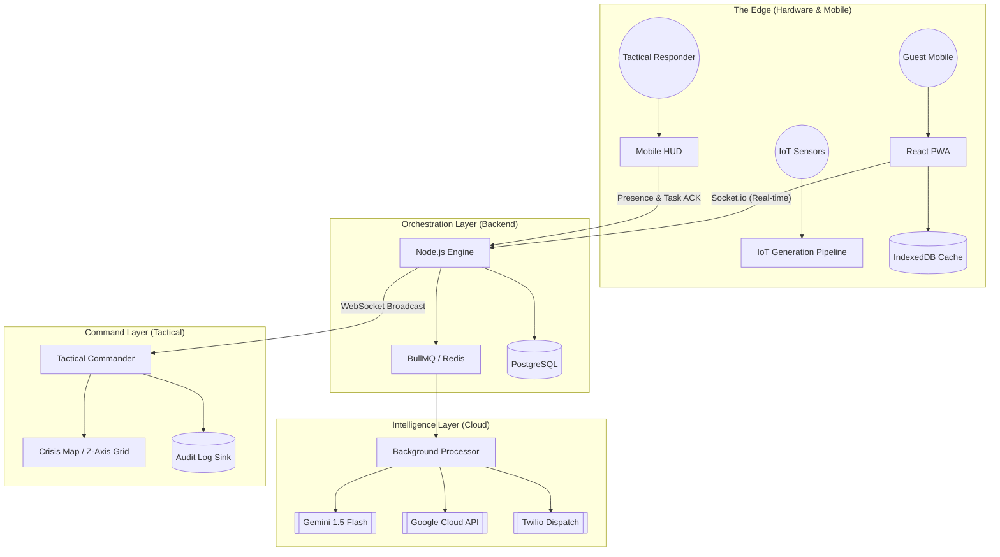

# 🏛️ SYSTEM ARCHITECTURE
## *Rapid Crisis Response // Technical Deep-Dive*

This document outlines the high-level design and data flow of the RCR ecosystem, defining its **Ultra Level** resilience and intelligence layers.

---

## 1. High-Level Component Map

---

## 2. Core Pipelines

### 🎙️ Voice SOS Pipeline
1.  **Capture**: `MediaRecorder API` captures audio chunks in the `PhoneModal`.
2.  **Ingestion**: Audio is Base64 encoded and POSTed to `/api/sos/voice`.
3.  **Transformation**: The backend routes the buffer to **Google Cloud Speech-to-Text** for transcription.
4.  **Localization**: If the detected language is non-English, it's processed by **Google Cloud Translation**.
5.  **Triage**: The English text is sent to **Gemini 1.5 Flash** for severity classification and category mapping.
6.  **Persistence**: A formal incident is created in PostgreSQL and broadcasted to all responders.

### 📋 Tactical Orchestration (Ultra Level)
1.  **Decomposition**: AI-generated action plans are automatically split into individual `Task` records.
2.  **Smart Dispatch**: Tasks are assigned to the best-suited available responder based on role and Z-axis proximity.
3.  **Dead Man's Switch**: If a task isn't acknowledged via WebSockets within 5 seconds, an **SMS Override** is sent via Twilio.
4.  **Escalation Protocol**: If a critical incident (Severity 4+) remains unacknowledged for 3 minutes, a high-priority **Escalation SMS** is sent to the regional commander.
5.  **Verification**: Responders confirm "Objective Secured" via the Mobile HUD, instantly updating the Command Center.

### 📡 Real-Time IoT Stream
1.  **Generation**: A background worker simulates hotel sensor arrays (Smoke, Heat, CO2).
2.  **Broadcast**: Data is published to a Redis channel specific to the building (`hotel_{id}_iot`).
3.  **UI Sync**: The `IndoorHeatmap` component receives the `NEW_IOT_ALERT` via Socket.io.
4.  **Routing**: The evacuation engine recalculates the safest exit by dynamically avoiding rooms with high telemetry (> 60°C) or smoke density.

---

## 3. Resilience & Defense Layers

| Feature | Implementation | Purpose |
| :--- | :--- | :--- |
| **Secure Identity** | Firebase Auth (JWT) | Provides unified, enterprise-grade authentication across PWA and Backend. |
| **Crash-Proofing** | Centralized `catchAsync` & Global Error Middleware | Prevents Node.js process termination on API failure. |
| **Network Blackout** | Service Worker Background Sync + IndexedDB | Guarantees eventual delivery of SOS reports in low-signal areas. |
| **Dual-Channel Dispatch** | WebSocket + SMS Fallback | Ensures 100% delivery of tactical instructions regardless of Wi-Fi state. |
| **Escalation Logic** | BullMQ Delayed Jobs | Automates commander notification for unhandled life-safety incidents. |
| **Audit Integrity** | Structured `audit_logs` & `response_logs` | Provides liability-grade history of every status change and tactical action. |
| **Data Integrity** | Knex.js Migrations + ACID Transactions | Ensures consistent state across multi-tenant data. |

---

## 4. Visual Philosophy
The system adopts a **Tactical Command Center** aesthetic:
- **Palette**: `#0B0F19` (Deep Navy), `#22D3EE` (Electric Cyan), `#EF4444` (Hazard Red).
- **Feedback**: Pulsing animations for active hazards, scanning effects for floor grids.
- **Density**: High-signal visualization using Recharts, Google Maps Advanced Markers, and Responder Presence layers.

---

**RCR Architecture v4.0 // Ultra Level Orchestration Ready**
